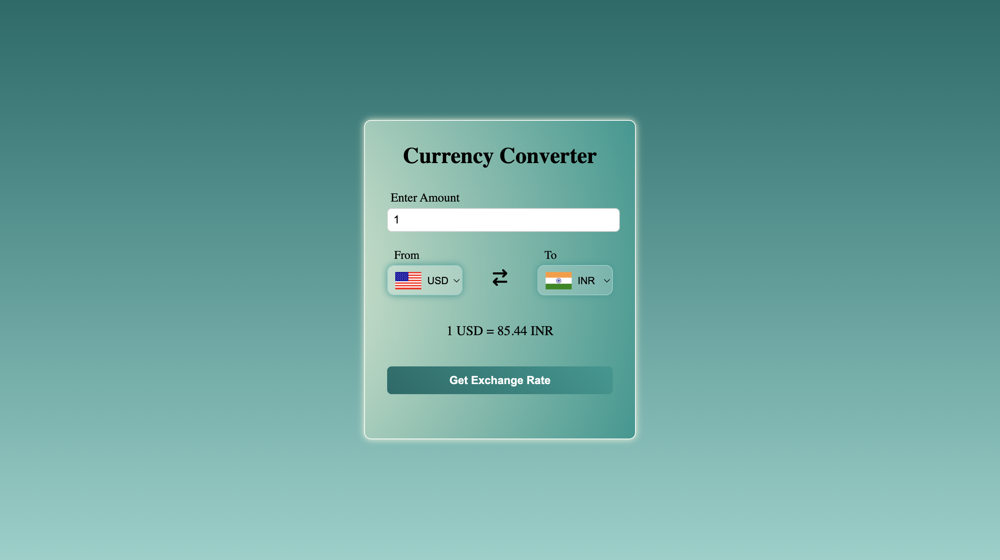

# 💱 Currency Converter (JavaScript)

A simple **Currency Converter** built using HTML, CSS, and JavaScript that allows users to convert amounts between different currencies using real-time exchange rates.

This project is ideal for beginners to understand how JavaScript interacts with APIs and updates data dynamically on a webpage.

---

## 👋 Introduction

This is a beginner-friendly JavaScript project focused on practical learning.

Instead of only learning syntax, this project helps you understand how JavaScript is used in real-world applications such as fetching live data, handling user input, and updating the UI dynamically.

If APIs feel confusing at first, don’t worry — this project will help you get comfortable with them step by step.

---

## 🖼️ Project Preview



*A simple currency converter interface with country flags and dropdowns.*

---

## 🎯 What Does This Project Do?

In simple terms, this project:

- Takes an amount from the user  
- Allows selecting source and target currencies  
- Fetches real-time exchange rates from an API  
- Converts the entered amount instantly  
- Displays the converted value clearly  

Currency converters are commonly used in **finance apps, travel websites, and e-commerce platforms**.

---

## 🧠 JavaScript Concepts Used

This project helps you practice the following concepts:

- Variables and constants  
- Functions  
- Event listeners  
- Fetch API  
- Async / Await  
- DOM manipulation  
- Conditional statements  

You don’t need prior experience with APIs — this project teaches them through usage.

---

## 📁 Project Structure
```text
    rock-paper-scissors/
    ├── index.html
    ├── style.css
    ├── script.js
    ├── preview.png
    └── README.md
```
---

## ⚙️ How This Project Works (Step-by-Step)

1. The page loads with default currencies selected  
2. Dropdown menus are populated dynamically using JavaScript  
3. Country flags change automatically when currency changes  
4. The user enters an amount  
5. JavaScript fetches live exchange rates from an API  
6. The converted amount is calculated and displayed  

---

## 🔍 Important Logic Explanation

- Currency options are added dynamically using JavaScript  
- User input is validated before conversion  
- Exchange rates are fetched using the Fetch API  
- Async/Await is used to handle API responses  
- The UI updates dynamically without page reload  

The focus is on understanding **how data flows from the API to the UI**.

---

## 🔄 Extra Features

- Real-time exchange rate fetching  
- Dynamic country flags  
- Default currency selection  
- Input validation  

---

## 🧪 Try These Improvements (Practice)

Once you understand the project, try adding:

- Currency swap button functionality  
- Better error handling for API failures  
- Limiting decimal places  
- Loading indicators while fetching data  
- Saving last selected currencies using localStorage  

Experimenting will strengthen your JavaScript skills.

---

## 📚 What You Will Learn From This Project

After completing this project, you will be able to:

- Work with external APIs in JavaScript  
- Handle user input and validation  
- Update the DOM dynamically  
- Use async/await confidently  
- Build real-world JavaScript applications  

---

## 🚀 Next Steps

- Try rebuilding the project without checking the code  
- Improve UI or add new features  
- Move on to the next JavaScript project in the repository  

---

## 💡 Final Note

Take your time and focus on understanding the logic instead of rushing.

Mastering small projects like this will make advanced JavaScript concepts much easier later.

Happy coding 💻✨