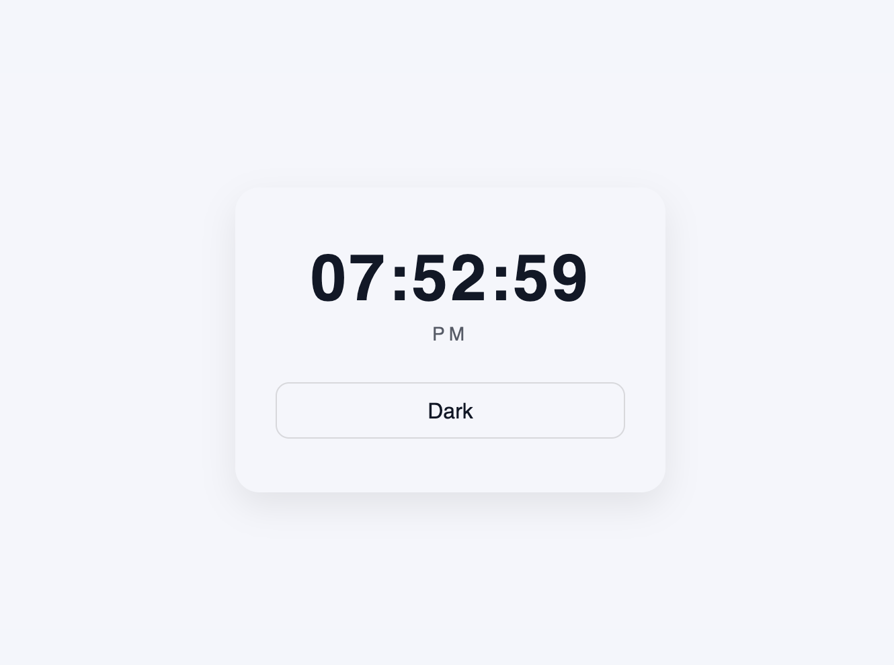
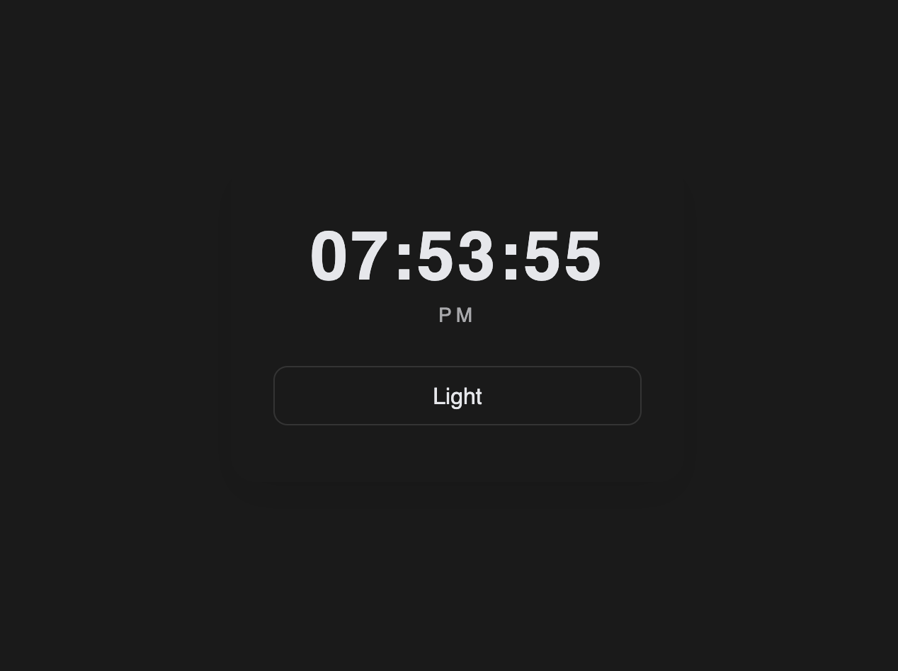

# ⏰ Digital Clock Web App


A sleek and modern **Digital Clock Web Application** built using **pure HTML, CSS, and JavaScript** that displays real-time updates with a persistent **Light/Dark theme toggle**.

This project demonstrates how JavaScript interacts with time-based functions, updates the UI dynamically every second, and preserves user preferences using **localStorage** — a core concept used in production applications.

---

## 🚀 Live Preview




> 💡 **Pro Tip:** Add a GIF instead of an image to instantly make your repository look more premium and engaging.

---

## 🌟 Why This Project Is Valuable

At first glance, a digital clock may seem simple — but it teaches some of the **most essential frontend engineering concepts**, including:

👉 Real-time UI updates  
👉 Time-based JavaScript execution  
👉 State persistence  
👉 Theme switching  
👉 Clean UI transitions  

Projects like this help you transition from writing scripts to **building real applications**.

---

## 🎯 Core Features

### ⌛ Real-Time Clock
- Displays accurate hours, minutes, and seconds  
- Updates automatically every second  
- Converts 24-hour format into **12-hour format**  
- Shows **AM / PM** indicator  

⚡ Powered by JavaScript's `Date()` object and `setInterval()`.

---

### 🌗 Persistent Light / Dark Mode

A modern UI must respect user preferences — and this project does exactly that.

✔ Toggle between light and dark themes  
✔ Smooth background transitions  
✔ Automatically remembers the selected theme  
✔ Loads saved preference on refresh  

This mimics behavior found in professional applications like YouTube and GitHub.

---

## 🧠 Concepts Demonstrated

Mastering these puts you ahead of most beginners:

- **Date & Time API** – Working with real-world time data  
- **setInterval()** – Running scheduled updates  
- **DOM Manipulation** – Updating elements dynamically  
- **Event Handling** – Responding to user interaction  
- **Class Toggling** – Managing UI states  
- **localStorage** – Persisting user preferences  
- **Template Literals** – Cleaner string formatting  

👉 These are foundational skills for frameworks like **React**.

---

## 🎨 Tech Stack

**Frontend**
- HTML5  
- CSS3  
- JavaScript (ES6)  

**Design Philosophy**
- Minimal  
- Centered layout  
- Smooth transitions  
- Distraction-free interface  

❗ No frameworks  
❗ No libraries  

Just **pure JavaScript mastery.**

---

## 📁 Project Structure
```text
    rock-paper-scissors/
    ├── index.html
    ├── style.css
    ├── script.js
    ├── preview1.png
    ├── preview2.png
    └── README.md
```
---

## ⚙️ How It Works

1. JavaScript fetches the current system time.
2. The time is formatted into a readable 12-hour structure.
3. The UI updates every second without page reload.
4. Users can toggle between light and dark themes.
5. The selected theme is saved in **localStorage**.
6. When the page reloads — the preference is restored automatically.

This reflects how modern apps remember user settings.

---

## ✨ Highlights

✅ Real-time clock updates  
✅ AM / PM formatting  
✅ Persistent theme memory  
✅ Smooth UI transitions  
✅ Clean and readable logic  
✅ Beginner-friendly yet powerful  
✅ Strong foundation for advanced projects  

---

## 🔥 Upgrade Ideas (Make It Portfolio-Worthy)

Want to stand out from 90% of developers? Try upgrading it:

- 🌍 Show multiple time zones  
- 📅 Display full date (Day, Month, Year)  
- ⏳ Add stopwatch & countdown timer  
- 🎨 Create gradient or neon clock UI  
- 🔊 Add alarm functionality  
- 📱 Improve mobile responsiveness  
- ⚡ Add subtle micro-animations  
- 🧊 Build a glassmorphism version  

👉 Turning small apps into feature-rich tools is what recruiters love to see.

---

## 📚 What You’ll Learn From This Project

By building this clock, you develop the ability to:

✔ Handle real-time data  
✔ Build dynamic interfaces  
✔ Persist application state  
✔ Improve user experience  
✔ Write cleaner JavaScript  

This is not just practice —  
it is **frontend engineering training.**

---

## 🏆 Developer Challenge

Push yourself further:

✅ Rebuild it from scratch without referencing the code  
✅ Design a more premium UI  
✅ Combine it with a weather widget  
✅ Convert it into a productivity dashboard  

Growth happens when you go beyond the tutorial.

---

## 💡 Final Thought

> “Programs must be written for people to read, and only incidentally for machines to execute.” — Harold Abelson  

Focus on writing code that is **clean, logical, and intentional.**

Great developers are not fast —  
they are **consistent.**

---

## 👨‍💻 Author

Built with focus and curiosity by a developer committed to mastering web technologies and creating polished user experiences.

If this project inspired you, consider giving it a ⭐  
It supports continuous building and learning.

---

**Happy Coding 💻⏳**