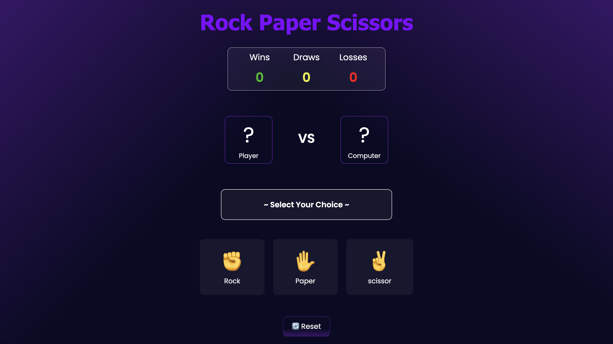

# ✊✋✌️ Rock Paper Scissors Game

A simple and interactive Rock Paper Scissors game built using HTML, CSS, and JavaScript.
This project is designed for beginners to learn JavaScript by building a real working game.

---

## 👋 Introduction

This project helps beginners understand how JavaScript works in real applications.
Instead of only learning theory, you will see how JavaScript handles user actions, logic, and UI updates.

Don’t worry if everything doesn’t make sense immediately — learning happens step by step.

---

## 🖼️ Project Preview



---

## 🎯 What Does This Project Do?

In this project:
- The user selects Rock, Paper, or Scissors
- The computer makes a random choice
- JavaScript compares both choices
- The result (Win / Lose / Draw) is displayed
- Wins, Draws, and Losses are tracked
- A reset button restarts the game

---

## 🧠 JavaScript Concepts Used

- Variables
- Functions
- Event Listeners
- Conditional Statements (if / else)
- Random Number Generation
- DOM Manipulation

You don’t need to master these before starting.
This project is meant to teach them through practice.

---

## 🛠️ Technologies Used

- HTML – Structure
- CSS – Styling
- JavaScript – Logic

(No frameworks or libraries are used.)

---

## 📁 Project Structure
```text
    rock-paper-scissors/
    ├── index.html
    ├── style.css
    ├── script.js
    ├── preview.png
    └── README.md
```
---

## ⚙️ How This Project Works (Step-by-Step)

1. The page loads with the game UI and score board.
2. The user clicks on Rock, Paper, or Scissors.
3. JavaScript captures the user’s choice using event listeners.
4. The computer randomly selects one option.
5. JavaScript compares both choices using game rules.
6. The result is shown on the screen.
7. The score is updated accordingly.

---

## 🔍 Important Logic Explanation

- Event listeners detect user clicks.
- A random number decides the computer’s move.
- Conditional logic determines win, loss, or draw.
- JavaScript updates the UI dynamically.

Focus on understanding why the logic works.

---

## 🔄 Extra Features

- Live score board (Wins / Draws / Losses)
- Display of player and computer choices
- Reset button to restart the game anytime

---

## 🧪 Try These Improvements (Practice)

Once you understand the project, try adding:
- A score limit (first to 5 wins)
- Animations for choices
- Sound effects
- Save scores using localStorage
- Improve mobile responsiveness

Experimenting is how real learning happens.

---

## 📚 What You Will Learn From This Project

After completing this project, you will be able to:
- Handle user input using JavaScript
- Apply conditional logic
- Use random values
- Manipulate the DOM confidently
- Build a complete interactive mini-game

---

## 🚀 Next Step

- Rebuild the project without looking at the code
- Modify the UI or game logic
- Move to the next project in the repository

---

## 💡 Final Note

>Don’t rush the learning process.
>Understanding the logic matters more than finishing quickly.

Happy coding 💻🎮