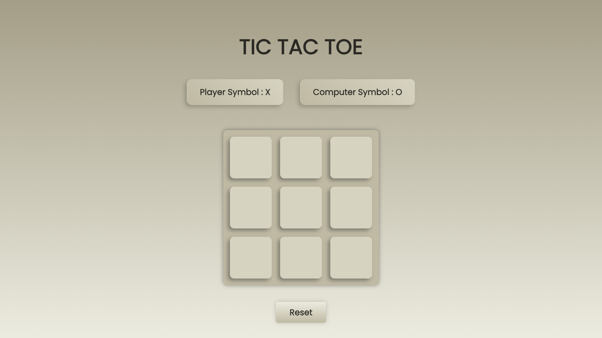

# 🎮 Tic Tac Toe Game (JavaScript)

A simple **Tic Tac Toe game** built using HTML, CSS, and JavaScript to help beginners understand game logic, DOM manipulation, and user interactions.

---

## 👋 Introduction

This is a beginner-friendly JavaScript project designed to show how JavaScript works in real-world applications.

Instead of focusing only on theory, this project follows a **learn-by-building** approach, where you understand concepts by creating an actual playable game.

If you feel confused at first, that’s completely normal — take your time and keep experimenting.

---

## 🖼️ Project Preview



*A simple Tic Tac Toe board where the user plays against the computer.*

---

## 🎯 What Does This Project Do?

In simple terms, this project:

- Allows the player to play Tic Tac Toe against the computer  
- Takes user input through mouse clicks  
- Generates computer moves automatically  
- Checks for winning and draw conditions  
- Displays the game result  

This type of logic is commonly used in **games, quizzes, and interactive web applications**.

---

## 🧠 JavaScript Concepts Used

This project helps you practice the following JavaScript concepts:

- Variables  
- Arrays  
- Functions  
- Event Listeners  
- Conditional Statements  
- DOM Manipulation  
- Random number generation  

You do not need to master these concepts beforehand.  
This project helps you learn them through practice.

---

## 📁 Project Structure
```text
    rock-paper-scissors/
    ├── index.html
    ├── style.css
    ├── script.js
    ├── preview.png
    └── README.md
```
---

## ⚙️ How This Project Works (Step-by-Step)

1. The game board is displayed when the page loads  
2. The player clicks on a box to place **X**  
3. JavaScript stores each move in an array  
4. The game checks if the player has won  
5. The computer randomly selects an empty box and places **O**  
6. The game continues until a player wins or the match ends in a draw  

---

## 🔍 Important Logic Explanation

- User clicks are captured using `addEventListener`  
- The board state is stored using a JavaScript array  
- Winning combinations are checked using predefined patterns  
- The UI updates dynamically using DOM manipulation  
- Game flow is controlled using conditional logic  

The focus is on understanding **why the logic works**, not memorizing the code.

---

## 🔄 Extra Features

- Computer opponent  
- Reset functionality  
- Win detection  
- Draw detection  

---

## 🧪 Try These Improvements (Practice)

Once you understand the project, try adding:

- Highlighting the winning boxes  
- Score tracking  
- Smarter computer logic  
- Animations or sound effects  

Experimenting with features is the best way to learn.

---

## 📚 What You Will Learn From This Project

After completing this project, you will be able to:

- Build interactive JavaScript games  
- Handle user interactions confidently  
- Apply conditional logic in real projects  
- Manipulate the DOM effectively  

---

## 🚀 Next Steps

- Try rebuilding the project without looking at the code  
- Modify the UI or logic on your own  
- Move on to the next project in the repository  

---

## 💡 Final Note

Take your time and focus on understanding the logic.  
Progress matters more than speed.

Happy coding 🎮💻