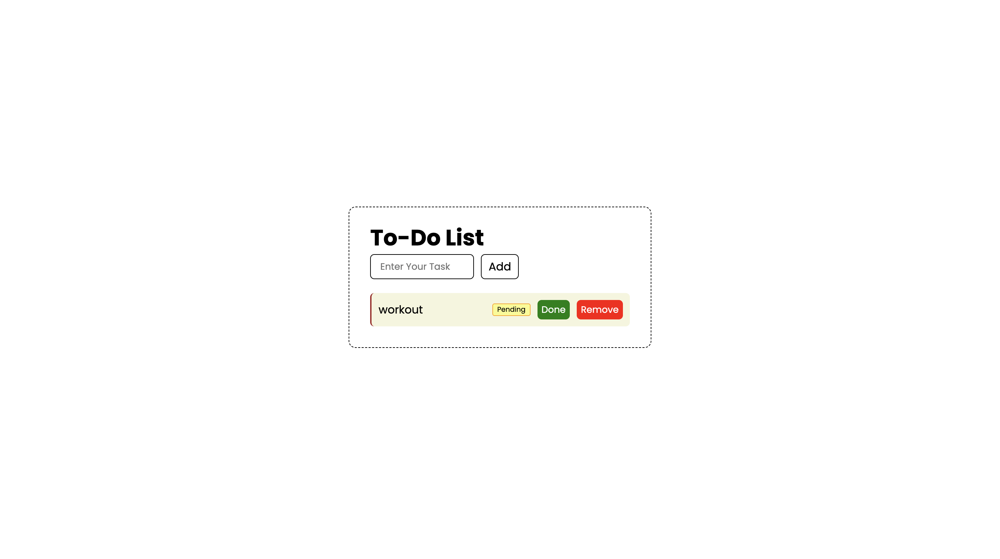

# ✅ To-Do List Web App


A modern, clean, and interactive **To-Do List Web Application** built using **pure HTML, CSS, and JavaScript**.

This project demonstrates how real-world web apps handle user input, dynamically update the interface, and manage application state — all without using frameworks.

Perfect for developers starting their **frontend journey** and looking to build strong JavaScript fundamentals.

---

## 🚀 Live Preview



> 💡 **Tip:** Add a screenshot or GIF named `preview.png` to instantly make your repository look more professional.

---

## 🌟 Why This Project Matters

Most beginners learn JavaScript through theory — but real growth happens when you **build**.

This project helps you move from:

👉 Static webpages → Interactive applications  
👉 Writing code → Solving real UI problems  
👉 Learning syntax → Thinking like a developer  

It is considered one of the **must-build projects** for mastering DOM manipulation.

---

## 🎯 Core Functionality

This application allows users to manage daily tasks efficiently with a smooth and minimal interface.

### ✔ Add Tasks
- Instantly create new tasks  
- Prevents empty submissions  
- Supports **Enter key** for faster workflow  

### ✔ Manage Task Status
- Tasks begin with a **Pending** label  
- Toggle between **Done ↔ Undo**  
- Completed tasks get visual feedback  

### ✔ Remove Tasks
- Delete tasks instantly  
- Keeps the interface clutter-free  

⚡ All updates happen **without refreshing the page**.

---

## 🧠 Key Concepts Demonstrated

This project strengthens the most important JavaScript skills every frontend developer needs:

- **DOM Manipulation** – Dynamically creating and updating elements  
- **Event Handling** – Responding to user actions in real time  
- **Event Delegation** – Efficiently managing multiple button interactions  
- **Conditional Logic** – Controlling UI behavior  
- **Dynamic Rendering** – Updating the page without reloads  
- **Clean UI Structuring** – Writing readable and scalable code  

👉 Mastering these concepts prepares you for frameworks like **React**.

---

## 🎨 Tech Stack

**Frontend**
- HTML5  
- CSS3  
- JavaScript (ES6)

**Design**
- Google Fonts — *Poppins*  
- Minimal UI with focus on usability  

❗ No libraries.  
❗ No frameworks.  

Just **pure developer skill.**

---

## 📁 Project Structure
```text
    rock-paper-scissors/
    ├── index.html
    ├── style.css
    ├── script.js
    ├── preview.png
    └── README.md
```
---

## ⚙️ How It Works

1. User enters a task.
2. JavaScript validates the input.
3. A new task element is generated dynamically.
4. Action buttons are attached automatically.
5. Users can mark tasks as completed or remove them.
6. The interface updates instantly using DOM manipulation.

This mirrors the behavior of real productivity tools.

---

## ✨ Highlights

✅ Beginner-friendly architecture  
✅ Clean and readable code  
✅ Instant UI updates  
✅ Minimal and distraction-free design  
✅ Strong focus on JavaScript fundamentals  
✅ Perfect stepping stone to advanced projects  

---

## 🔥 Upgrade Ideas (Turn This Into a Portfolio Project)

Want to stand out from other developers? Build on top of this:

- 💾 Persist tasks with **localStorage**
- 🌙 Add **Dark Mode**
- ✏️ Enable task editing  
- 📱 Improve mobile responsiveness  
- 🎬 Add micro-interactions & animations  
- 🗂️ Implement drag-and-drop sorting  
- ⏰ Add deadlines & priority labels  
- ☁️ Convert it into a **Full-Stack App**

👉 Recruiters LOVE seeing evolution in projects.

---

## 📚 What You’ll Gain From Building This

After completing this project, you will confidently know how to:

✔ Translate logic into UI behavior  
✔ Build interactive web apps  
✔ Handle real user actions  
✔ Write structured JavaScript  
✔ Think like a frontend engineer  

This is not just a tutorial project —  
it is a **foundation for everything you build next.**

---

## 🏆 Developer Challenge

Take it one step further:

✅ Rebuild it **without looking at the source code**  
✅ Improve the design  
✅ Add advanced features  
✅ Optimize performance  

Small projects create **big developer growth**.

---

## 💡 Final Note

> “First, solve the problem. Then, write the code.” — John Johnson  

Don’t rush.

Focus on understanding **why** the logic works — not just making it run.

Consistency beats intensity in software development.

---

## 👨‍💻 Author

Built with dedication by a passionate developer focused on mastering web technologies and creating interactive user experiences.

If you found this project helpful, consider giving it a ⭐  
It motivates continued learning and building!

---

**Happy Coding 💻🚀**